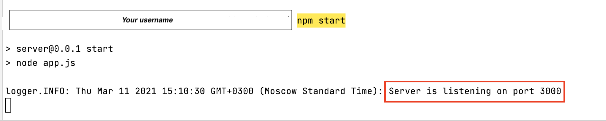
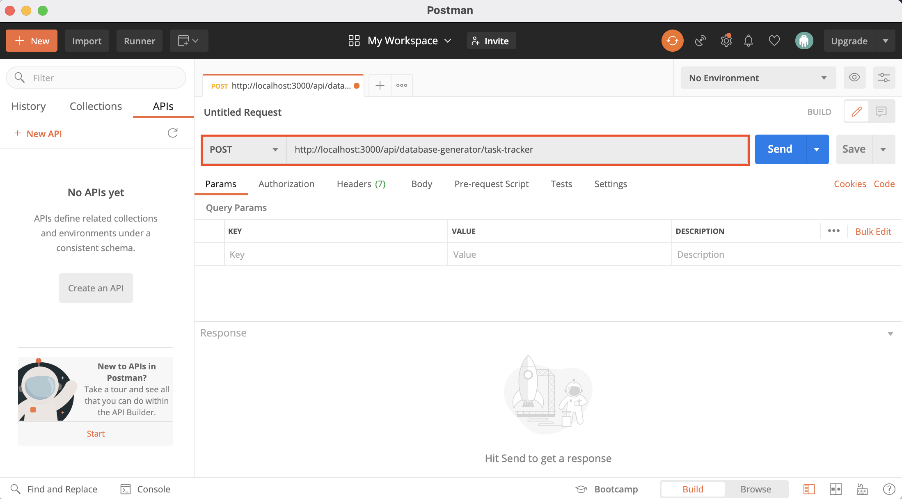

# Table of Contents

- [TaskTracker Server](#tasktracker-server)
  - [Installation](#installation)
  - [Database generation](#database-generation)
  - [Models](#models)
    - [Data item](#data-item)    
    - [Activity tracker item](#activity-tracker-item)    


# TaskTracker Server

-----A server for interaction with the [TaskTracker plugin](https://github.com/JetBrains-Research/task-tracker-plugin).

TaskTracker Server is part of the TaskTracker toolkit for collecting and processing data of student activity during problem-solving.

The primary goal of this project is data collection. First, tracking and analysis of students’ coding behavior can be a valuable source of insight into the learning process: for example, help the teacher to improve their course and understand which topics and assignments may be more difficult for students. Second, such data may be used in computing education research. If you choose to share your problem-solving data with us, it will help our code completion studies.

For more information about TaskTracker, consult the following resources:

- [wiki](https://github.com/JetBrains-Research/task-tracker-server/wiki)
- [research paper](https://arxiv.org/abs/2012.05085)
- presentation (--link--)
- [demo](https://www.youtube.com/watch?v=ZZXmiFCAgTI).


---

## Requirements

1. [MongoDB](https://www.mongodb.com/)
2. [Node.js](https://nodejs.org/en/)
3. [npm](https://www.npmjs.com/)

---

## Installation

1. Download the repository.
2. Run [MongoDB](https://www.mongodb.com/). It has to work on the `localhost:27017`.
   <!---how to verify??--->
3. Install TaskTracker packages by issuing `install npm` as root from the server installation directory:
  ```
  sudo install npm
  ```
   
4. Issue `npm start` as root from the server installation directory. It will work on `localhost:3000`.

If everything is done correctly, you will see the following message:



---

## Database generation

<!---what are the exact steps of replacing files in the database? --->
The data for the database can be found in [/configs/task-tracker-sources](/configs/task-tracker-sources).
You can change the data for plugins before generating the database.

To generate a database for the [TaskTracker](https://github.com/JetBrains-Research/task-tracker-plugin) plugin, send the `POST` request to`<path_to_your_server>/api/database-generator/task-tracker`.

**Note:** The default `<path_to_your_server>` is `localhost:3000`.

See an example using [Postman](https://www.postman.com/):



---

## Models

<!---update tables--->
The section describes the models and routes in the server. 
For a complete description of all models, see the [API reference](https://github.com/JetBrains-Research/task-tracker-server/wiki/API) in the wiki.

### Data item

The model stores --- _user files_ from the [TaskTracker](https://github.com/JetBrains-Research/task-tracker-plugin) plugin.

#### Model

Field | Type | Description
---   | --- | ---
**id** |  [ObjectId](https://docs.mongodb.com/manual/reference/method/ObjectId/)  |  internal **MongoDB** id
**externalDiId** |  Integer | external id
**codePath** |  String | path for the _user file_ in the server
**activityTrackerKey** |  String | external _activity-tracker id_

#### Routes

URL | Type | Description
---   | --- | --- 
`/api/data-item`    | `POST` | create a new data-item in the database
`/api/data-item/all`| `GET`  | get all data-items
`/api/data-item/:id`| `GET`  | get data-item by external id

**Note**: For more information, see [Data item operations](https://github.com/JetBrains-Research/task-tracker-server/wiki/API:-Data-item#routes) in the wiki.


### Activity tracker item

--The model stores ---_activity-tracker files_ from the [TaskTracker plugin](https://github.com/JetBrains-Research/task-tracker-plugin).

#### Model

Field | Type | Description
---   | --- | ---
**id** |  ObjectId  |  internal [MongoDB id](https://docs.mongodb.com/manual/reference/method/ObjectId/)
**externalAtiId** |  Integer | external id
**codePath** |  String | path for the _activity tracker file_ in the server

#### Routes

URL | Type | Description
---   | --- | --- 
`/api/activity-tracker-item`    | `POST` | create a new activity-tracker-item in the database
`/api/activity-tracker-item/all`| `GET`  | get all activity-tracker-items
`/api/activity-tracker-item/:id`| `GET`  | get activity-tracker-item by external id

  **Note**: For more information, see [Activity Tracker operations](https://github.com/JetBrains-Research/task-tracker-server/wiki/API:-Activity-tracker-item#routes) in the wiki.
